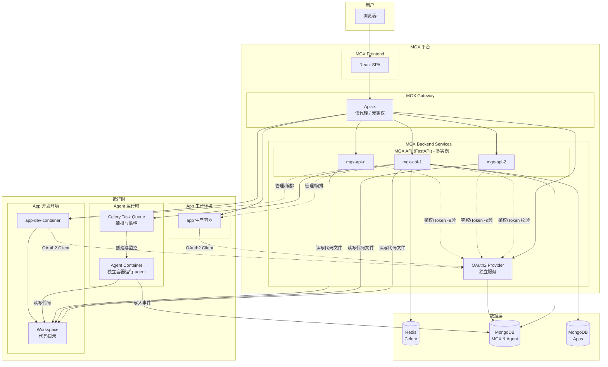
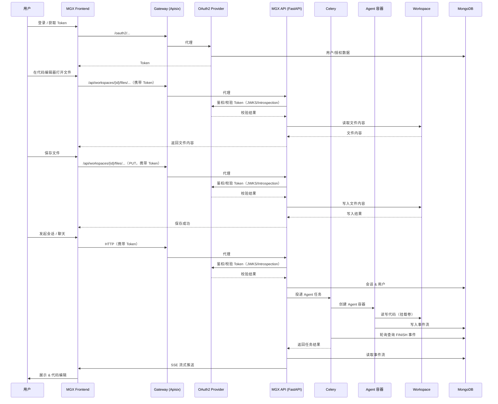
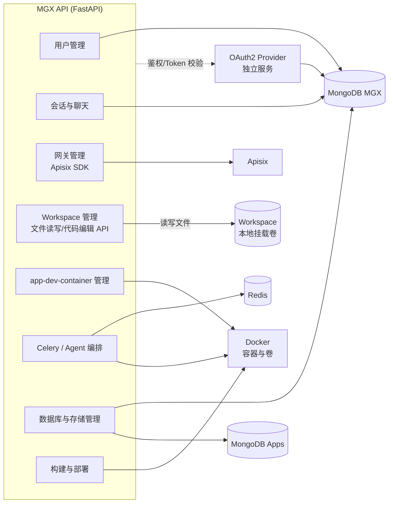
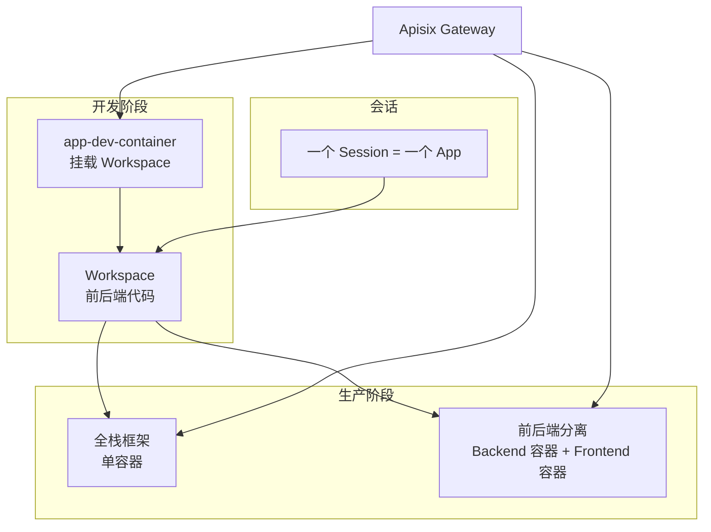
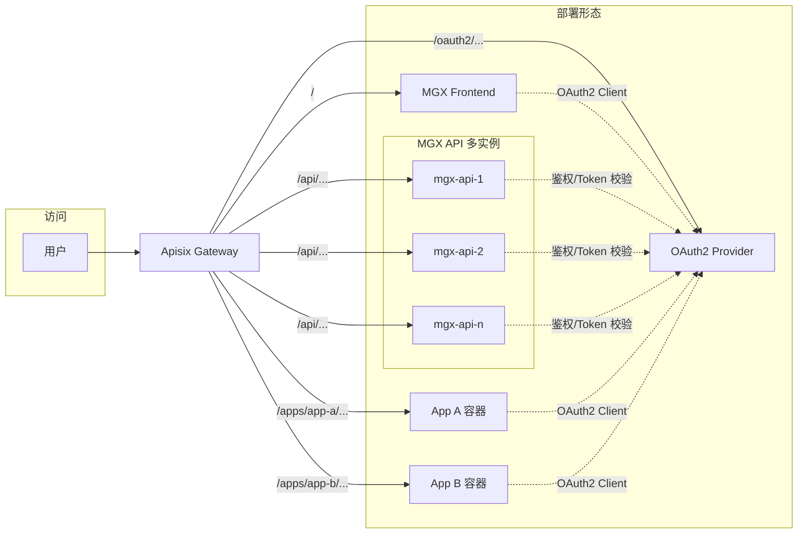
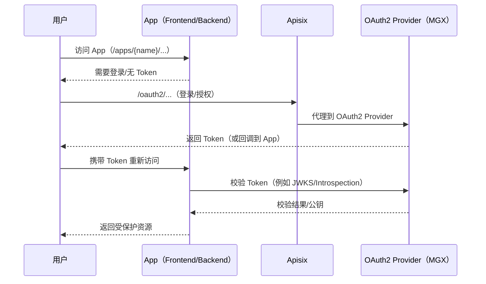
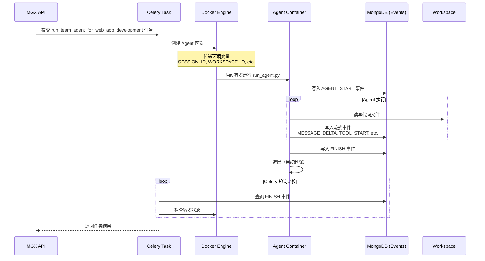

# Project target
MGX: A PaaS demo with agent generated web app

# Definition
- MGX: The Platform name where agent develop and deploy apps
- App: a web app generated by agent
- Workspace: a directory for a app's code
- app-dev-container: a container for running a app's dev servers
- agent team: a team of agents for generating web app code

# Project features
- MGX UI 
    - start session to chat with agent team
    - one session to one app
    - agent team study and generate web app code
    - Generated backend and frontend code in one workspace dir
    - both user and agent can view and edit the code
    - app's user management
    - app's database management
    - app production log
    - readonly terminal for app's containers 
    - ssh access to app-dev-container for development
- MGX provide oauth2 provider for apps
    - supported methods:
        - user password
    - MGX's own authentication use the same oauth2 provider
- Supported frameworks with template:
    - Next.js
    - Fastapi + React Vite SPA
    these templates include:
        - oauth2 auth with MGX provider
        - MongoDB basic collections and connection codes
            - user
        - OpenTelemetry tracing and logging
- Build and deploy production images with docker api
    - if fullstack framework, build and deploy in one container
    - else build and deploy separately

- Proxy apps under MGX domain subpath (url friendly app name) 
## Limitation
- only deploy app in single instance mode (one container for backend and one container for frontend, or one container for both)
- no https
- no multi-tenant

# Project architecture
- MGX frontend (React SPA)
- MGX gateway (apisix docker)
    - only proxy
    - no authentication
- MGX app backend (FastAPI)
    - oauth2 provider
    - user management
    - chat and session management
    - gateway management (apisix sdk)
    - workspace management
    - manage app-dev-container with local mounted volume for workspace
    - use celery to orchestrate agent containers
    - manage database and storage
    - build and deploy production environment
- Docker container and volume for running app-dev-servers
- Agent container (独立运行)
    - 每个 session 在独立容器中运行 agent
    - Agent 直接读写 workspace 文件（通过挂载卷）
    - Agent 将事件写入 MongoDB
    - 容器运行完成后自动删除
- Celery task queue
    - 创建和启动 agent 容器
    - 轮询 event 表监控 agent 完成状态
    - 处理超时和错误
- Redis for celery
- MongoDB for MGX and agent
- MongoDB for Apps

## Architecture diagrams

### 1. 系统总体架构

### 2. 请求与数据流（会话 → Agent → Workspace）

### 3. MGX Backend 与周边组件

### 4. App 从开发到生产

### 5. 部署与访问形态（App 单实例 + 子路径）

### 6. App 使用 MGX OAuth2 Provider（示意时序）

### 7. Agent 容器化架构详解

#### Agent 容器化设计要点

1. **职责分离**
   - **Celery Task**: 负责容器的创建、启动、监控和超时处理
   - **Agent Container**: 负责实际的 agent 执行逻辑和事件写入
   - **FastAPI SSE**: 负责读取事件并流式推送给客户端

2. **容器生命周期**
   - 每个 session 创建一个独立的 agent 容器
   - 容器名称: `mgx-agent-{session_id}`
   - 容器运行完成后自动删除 (`remove=True`)
   - 支持资源限制（内存、CPU）

3. **环境变量传递**
   - `SESSION_ID`: Session ID
   - `WORKSPACE_ID`: Workspace ID
   - `FRAMEWORK`: 目标框架
   - `PROMPT`: 用户提示词
   - `MONGODB_URL`, `MONGODB_DB`: 数据库连接信息
   - `LANGFUSE_*`: Langfuse 配置（如果启用）

4. **监控机制**
   - Celery task 轮询 event 表查找 `FINISH` 事件
   - 同时检查容器状态（运行中/退出）
   - 支持超时机制（默认 30 分钟）
   - 超时后强制停止容器

5. **挂载卷**
   - Workspace 目录挂载到容器的 `/workspace`
   - Agent 可以直接读写代码文件

6. **网络配置**
   - 容器使用 bridge 网络模式
   - 可以访问 MongoDB 和其他服务

7. **镜像构建**
   - 使用统一镜像 `infra/Dockerfile.mgx`（mgx-api、celery-worker、agent 共用）
   - 使用 uv sync 安装依赖（清华源）
   - 镜像标签: `mgx:latest`（可配置）

# Tech stack
- MGX frontend: React SPA
- MGX backend: Fastapi
- Agent framework: langchain multiagents (https://github.com/FoundationAgents/langchain multiagents)
- agent runtime: docker container
- MGX Database: MongoDB
- Gateway: Apisix
- Container: Docker
- trace and logging: opentelemetry