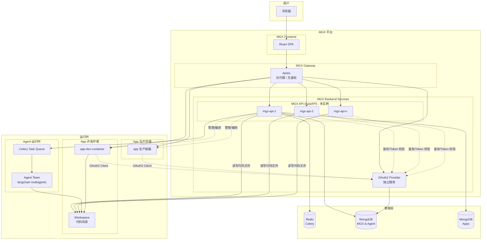
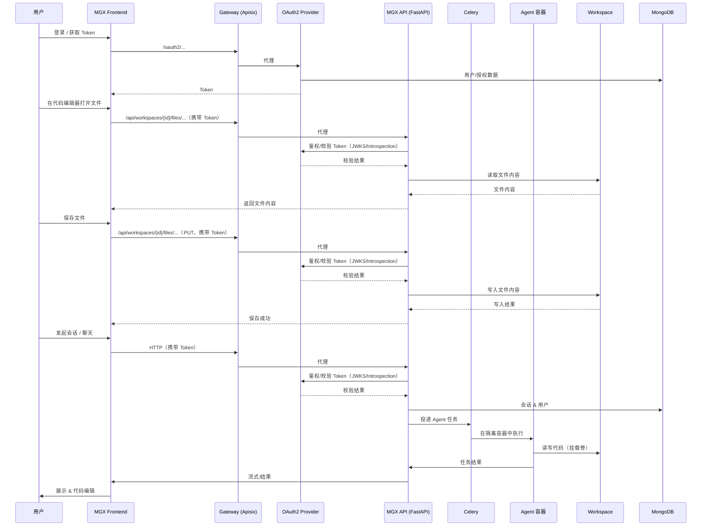
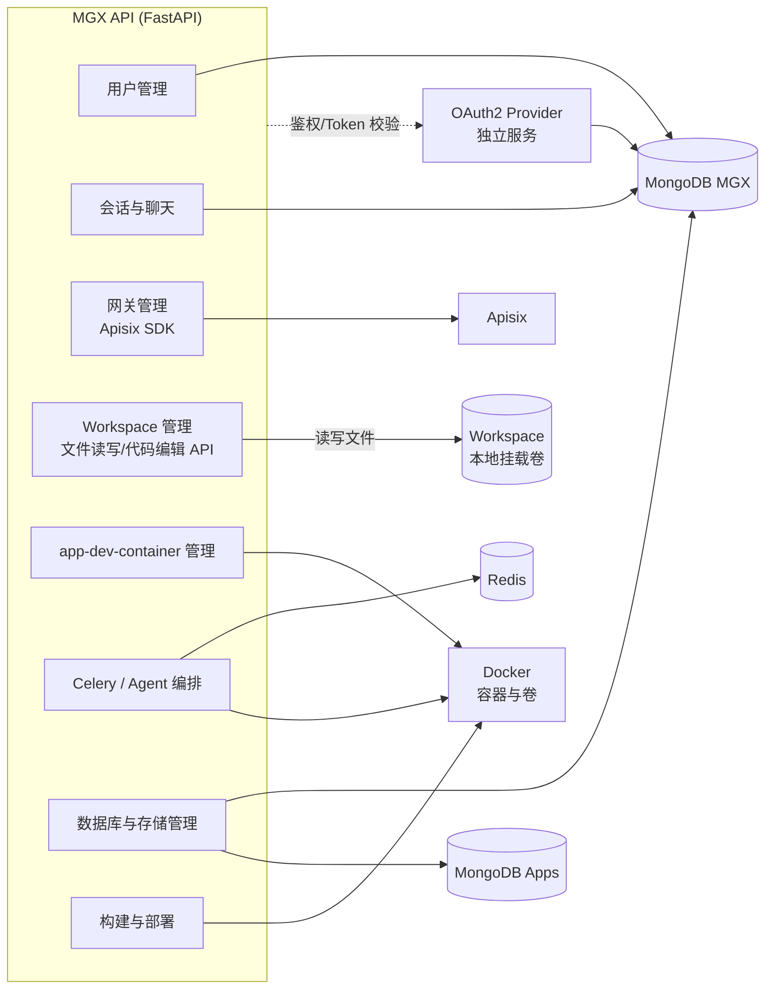
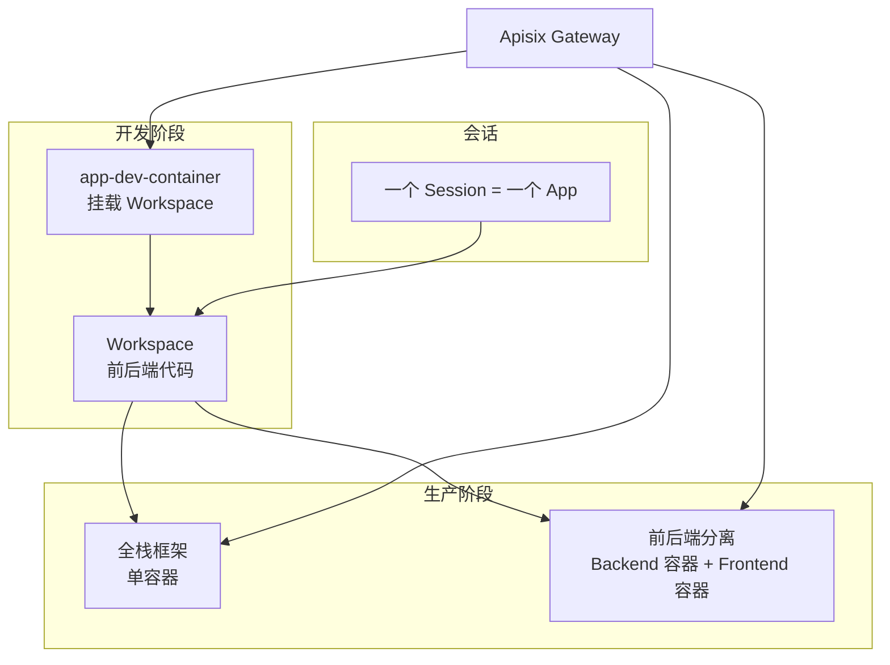
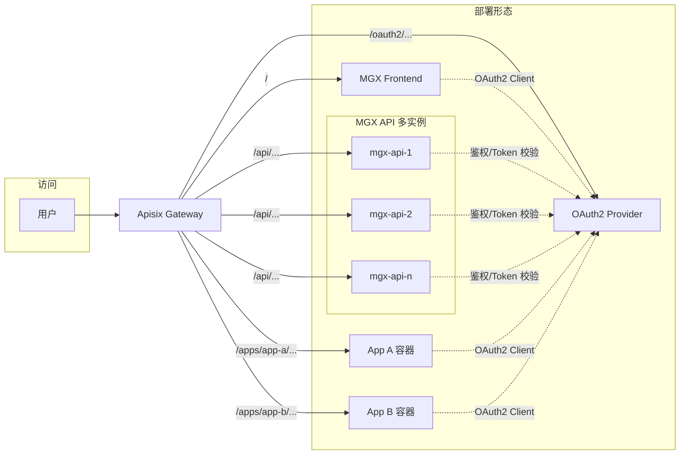
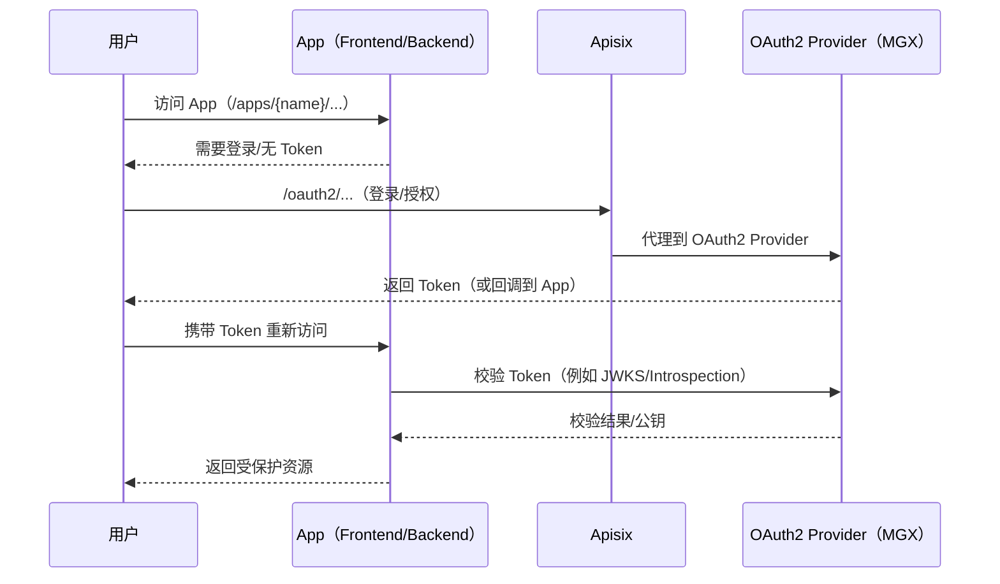

# Project target
MGX: A PaaS demo with agent generated web app

# Definition
- MGX: The Platform name where agent develop and deploy apps
- App: a web app generated by agent
- Workspace: a directory for a app's code
- app-dev-container: a container for running a app's dev servers
- agent team: a team of agents for generating web app code

# Project features
- MGX UI 
    - start session to chat with agent team
    - one session to one app
    - agent team study and generate web app code
    - Generated backend and frontend code in one workspace dir
    - both user and agent can view and edit the code
    - app's user management
    - app's database management
    - app production log
    - readonly terminal for app's containers 
    - ssh access to app-dev-container for development
- MGX provide oauth2 provider for apps
    - supported methods:
        - user password
    - MGX's own authentication use the same oauth2 provider
- Supported frameworks with template:
    - Next.js
    - Fastapi + React Vite SPA
    these templates include:
        - oauth2 auth with MGX provider
        - MongoDB basic collections and connection codes
            - user
        - OpenTelemetry tracing and logging
- Build and deploy production images with docker api
    - if fullstack framework, build and deploy in one container
    - else build and deploy separately

- Proxy apps under MGX domain subpath (url friendly app name) 
## Limitation
- only deploy app in single instance mode (one container for backend and one container for frontend, or one container for both)
- no https
- no multi-tenant

# Project architecture
- MGX frontend (React SPA)
- MGX gateway (apisix docker)
    - only proxy
    - no authentication
- MGX app backend (FastAPI)
    - oauth2 provider
    - user management
    - chat and session management
    - gateway management (apisix sdk)
    - workspace management
    - manage app-dev-container with local mounted volume for workspace
    - use celery to run agent in isolated containers with app's workspace volume
    - manage database and storage
    - build and deploy production environment
- Docker container and volume for running app-dev-servers
- Agent
- task queue
- Redis for celery
- MongoDB for MGX and agent
- MongoDB for Apps

## Architecture diagrams

### 1. 系统总体架构

### 2. 请求与数据流（会话 → Agent → Workspace）

### 3. MGX Backend 与周边组件

### 4. App 从开发到生产

### 5. 部署与访问形态（App 单实例 + 子路径）

### 6. App 使用 MGX OAuth2 Provider（示意时序）

# Tech stack
- MGX frontend: React SPA
- MGX backend: Fastapi
- Agent framework: langchain multiagents (https://github.com/FoundationAgents/langchain multiagents)
- agent runtime: docker container
- MGX Database: MongoDB
- Gateway: Apisix
- Container: Docker
- trace and logging: opentelemetry