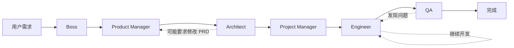

# Web App Development Team - 多代理协作系统

基于 LangGraph 的分层多代理团队架构，用于自动化 Web 应用开发。

## 概述

这个系统实现了一个由 6 个专业角色组成的开发团队：

```
Boss → Product Manager → Architect → Project Manager → Engineer → QA
```

每个角色都有明确的职责和专用工具，通过 LangGraph 编排实现高效协作。

## 团队成员

### 1. Boss Agent
- **职责**：需求提炼，提取核心目标
- **输入**：用户原始需求
- **输出**：`requirements.md`
- **工具**：文件读写
- **模型**：`agent_boss_model` (默认: gpt-4o-mini)

### 2. Product Manager Agent
- **职责**：编写详细的产品需求文档（PRD）
- **输入**：`requirements.md`
- **输出**：`prd.md`
- **工具**：文件读写、目录浏览
- **模型**：`agent_pm_model` (默认: gpt-4o-mini)

### 3. Architect Agent
- **职责**：技术架构设计、API 接口设计
- **输入**：`prd.md`
- **输出**：`design.md`
- **工具**：文件操作、代码搜索、RAG（架构模式、框架文档）
- **模型**：`agent_architect_model` (建议: gpt-4o)

### 4. Project Manager Agent
- **职责**：任务拆解、优先级设定
- **输入**：`prd.md`, `design.md`
- **输出**：`tasks.md`
- **工具**：文件读写
- **模型**：`agent_pjm_model` (默认: gpt-4o-mini)

### 5. Engineer Agent
- **职责**：编写代码、调试、安装依赖
- **输入**：`design.md`, `tasks.md`
- **输出**：源代码文件
- **工具**：文件操作、Docker 命令、包安装、RAG（代码示例）
- **模型**：`agent_engineer_model` (建议: gpt-4o)

### 6. QA Agent
- **职责**：编写测试、执行测试、报告问题
- **输入**：源代码、`prd.md`
- **输出**：测试文件、`test_report.md`
- **工具**：文件操作、测试执行、容器日志、RAG（测试实践）
- **模型**：`agent_qa_model` (默认: gpt-4o-mini)

## 工作流程



## 使用方式

### 基本使用

```python
from agents.web_app_team import create_web_app_team
from agents.web_app_team.state import create_initial_state

# 创建团队
team_graph = create_web_app_team(
    workspace_id="your-workspace-id",
    framework="nextjs",  # 或 "fastapi-vite"
    callbacks=[],  # 可选的回调函数
)

# 创建初始状态
initial_state = create_initial_state(
    workspace_id="your-workspace-id",
    framework="nextjs",
    user_prompt="创建一个用户管理系统，包含用户注册、登录、个人资料管理功能",
)

# 执行工作流
result = team_graph.invoke(initial_state)

# 查看结果
print(f"当前阶段: {result['current_stage']}")
print(f"PRD: {result['prd_document']}")
print(f"设计文档: {result['design_document']}")
```

### 配置模型

#### 1. 使用默认配置（全部 gpt-4o-mini）

```bash
AGENT_DEFAULT_MODEL=gpt-4o-mini
AGENT_DEFAULT_TEMPERATURE=0.7
```

#### 2. 成本优化配置（推荐）

只为核心角色配置强模型：

```bash
AGENT_DEFAULT_MODEL=gpt-4o-mini
AGENT_ARCHITECT_MODEL=gpt-4o
AGENT_ENGINEER_MODEL=gpt-4o
```

**预计节省 60-70% 成本** 💰

#### 3. 高质量配置

全部使用强模型：

```bash
AGENT_DEFAULT_MODEL=gpt-4o
AGENT_ARCHITECT_TEMPERATURE=0.3  # 更确定性
AGENT_ENGINEER_TEMPERATURE=0.5
```

### 在 Agent Runtime 中使用

设置环境变量：

```bash
AGENT_MODE=team  # 启用团队模式
```

然后正常运行 agent 容器，系统会自动使用团队模式。

## 工具集

### Workspace Tools

位于 `tools/workspace_tools.py`：

- ✅ `read_file(path)`: 读取文件
- ✅ `write_file(path, content)`: 写入文件
- ✅ `list_files(directory)`: 列出目录
- ✅ `delete_file(path)`: 删除文件
- ✅ `create_directory(path)`: 创建目录
- ✅ `search_in_files(pattern, directory)`: 搜索文件内容

**安全特性**：
- 所有路径通过 `safe_join()` 验证
- 防止目录遍历攻击
- 限制在 workspace 内操作

### Docker Tools

位于 `tools/docker_tools.py`：

- ✅ `exec_command(command, working_dir)`: 执行 shell 命令
- ✅ `get_container_logs(tail)`: 获取容器日志
- ✅ `install_package(package_name, package_manager)`: 安装依赖
- ✅ `run_tests(test_command)`: 运行测试
- ✅ `get_container_status()`: 获取容器状态

**安全特性**：
- 危险命令黑名单检查
- 容器状态验证
- 工作目录限制

### RAG Tools (框架已就位，待启用)

位于 `tools/rag_tools.py`：

- 🔄 `search_architecture_patterns(query)`: 搜索架构模式
- 🔄 `search_framework_docs(framework, query)`: 搜索框架文档
- 🔄 `search_testing_practices(query)`: 搜索测试实践
- 🔄 `search_code_examples(framework, component)`: 搜索代码示例

启用方式：

```bash
ENABLE_RAG=true
VECTOR_STORE_PATH=./vector_stores
```

### Search Tools (框架已就位，待启用)

位于 `tools/search_tools.py`：

- 🔄 `search_in_workspace(pattern, file_extension)`: 在代码库搜索
- 🔄 `search_web(query)`: Web 搜索
- 🔄 `find_similar_code(code_snippet)`: 查找相似代码

## 高级功能

### 上下文压缩

位于 `context_compression/`，支持 4 种策略：

1. **滑动窗口** (`sliding_window`): 保留最近 N 条消息
2. **关键提取** (`key_extraction`): 提取关键信息（决策、文档、错误）
3. **摘要** (`summarization`): 使用 LLM 生成摘要
4. **混合** (`hybrid`): 结合多种策略

配置：

```bash
CONTEXT_COMPRESSION_STRATEGY=sliding_window
CONTEXT_MAX_TOKENS=4000
CONTEXT_RECENT_WINDOW=15
ENABLE_CONTEXT_COMPRESSION=true
```

### Langfuse 集成

支持 LLM 调用追踪和监控：

```bash
LANGFUSE_PUBLIC_KEY=pk-lf-...
LANGFUSE_SECRET_KEY=sk-lf-...
LANGFUSE_HOST=https://cloud.langfuse.com
LANGFUSE_ENABLED=true
```

## 目录结构

```
web_app_team/
├── __init__.py              # 导出主要函数
├── state.py                 # 状态定义
├── graph.py                 # 工作流编排
├── team.py                  # 团队工厂函数
├── README.md               # 本文档
├── agents/                 # Agent 实现
│   ├── boss.py
│   ├── product_manager.py
│   ├── architect.py
│   ├── project_manager.py
│   ├── engineer.py
│   └── qa.py
├── tools/                  # 工具集
│   ├── workspace_tools.py
│   ├── docker_tools.py
│   ├── rag_tools.py
│   └── search_tools.py
├── prompts/                # 提示词
│   └── ...
├── context_compression/    # 上下文压缩
│   └── ...
└── rag/                   # RAG 模块
    └── ...
```

## 性能优化

### 模型选择建议

| 场景 | 配置 | 月成本估算 |
|------|------|-----------|
| 开发环境 | 全部 gpt-4o-mini | $10-20 |
| 生产环境（推荐）| Architect + Engineer 用 gpt-4o | $30-50 |
| 高质量模式 | 全部 gpt-4o | $100-150 |

### Token 优化

1. 启用上下文压缩
2. 合理设置 `max_iterations`
3. 精简提示词
4. 使用 RAG 减少 context 长度

## 故障排查

### Agent 无法访问文件

**问题**：Agent 报告"文件不存在"

**解决**：
1. 检查 `workspace_id` 是否正确
2. 确认 workspace 目录挂载正确
3. 检查文件路径是相对路径

### Docker 命令执行失败

**问题**：`exec_command` 返回错误

**解决**：
1. 检查 dev container 是否运行
2. 验证命令是否在黑名单中
3. 查看容器日志了解详情

### 模型配置不生效

**问题**：Agent 使用了错误的模型

**解决**：
1. 检查环境变量是否正确设置
2. 确认环境变量名称大写
3. 重启 agent 容器

## 已知限制

1. 工作流目前是线性的，不支持并行执行多个 Agent
2. 循环次数未限制（可能无限循环）
3. 不支持人工介入和审批
4. RAG 和搜索工具需要手动启用
5. 上下文压缩需要额外配置

## 后续计划

- [ ] 支持工作流可视化
- [ ] 添加人工介入点
- [ ] 实现并行执行优化
- [ ] 完善 RAG 知识库
- [ ] 添加更多测试工具
- [ ] 支持自定义 Agent
- [ ] 工作流模板系统

## 参考资料

- [LangGraph 文档](https://langchain-ai.github.io/langgraph/)
- [LangChain Agents](https://python.langchain.com/docs/modules/agents/)
- [Multi-Agent Systems](https://langchain-ai.github.io/langgraph/tutorials/multi_agent/)

## 贡献

欢迎提交 PR 改进团队系统！

## License

与主项目相同
